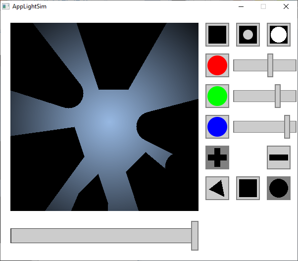
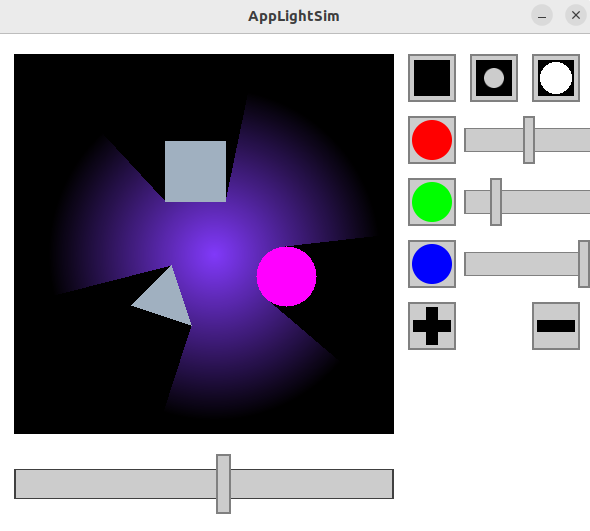

# Light Simulation App

C++ Project build on top of SDL2 graphics library.  
   
GUI built from scratch. Light Simulation built from scratch (each pixel gets updated individually, very slow, needs -O3 flag to run smoothly)

## Building the executable
### Linux (Ubuntu)
* Install GCC and make with:
```
sudo apt install build-essential
sudo apt install make
```
* Install SDL packages with:
```
sudo apt-get install libsdl2-2.0-0
sudo apt-get install libsdl2-dev
```
* Build with make 
Makefile is in the top level directory of this repo. Doesn't handle header file depedencies. Executable should be rebuilt with 'make clean' followed by 'make'
* Executable is named 'app'. Run with:
```
./app
```

### Windows
* Intall GCC and add "..\MinGW\bin" to PATH.
* Build with build.bat. Necessary SDL files should be included in SDL/ directory. For use with different installation of SDL, build.bat should be modified with proper linker flags.
* Run app.exe.
